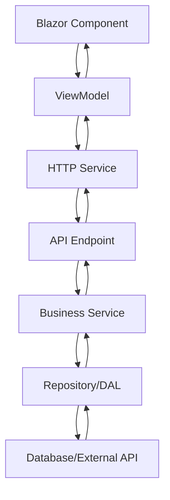

# Blazor WASM Template

A comprehensive full-stack template for Blazor WebAssembly applications built with .NET 9, featuring a clean waterfall architecture and modern UI components.

## Features

- **Modern Stack**: Built on .NET 9.0 with the latest Blazor WebAssembly
- **Clean Architecture**: Implements waterfall architecture with clear separation of concerns
- **MVVM Pattern**: Client-side MVVM design pattern with dependency injection
- **Rich UI**: Pre-configured with [MudBlazor](https://mudblazor.com/) for beautiful, responsive components
- **Fast APIs**: Powered by [FastEndpoints](https://fast-endpoints.com/) for high-performance API development
- **Local Storage**: Integrated [Blazored LocalStorage](https://github.com/Blazored/LocalStorage) for client-side data persistence
- **Ready to Use**: Comes pre-configured and ready for development

## Project Structure

```
blazor-wasm-template/
├── API/                    # Web API layer with FastEndpoints
├── BlazorApp.Client/       # Blazor WebAssembly client application
├── BlazorApp.Shared/       # Shared contracts and DTOs
├── BlazorApp.Utils/        # Shared business logic utilities
├── BLL/                    # Business Logic Layer
├── DAL/                    # Data Access Layer
└── Models/                 # Domain models and entities
```

## Architecture Overview

This template implements a waterfall architecture pattern with clear separation of concerns:

- **API Layer**: Handles HTTP requests and routing using FastEndpoints
- **BLL (Business Logic Layer)**: Contains business rules and application logic
- **DAL (Data Access Layer)**: Manages data persistence and retrieval
- **Client Layer**: Blazor WebAssembly frontend with MudBlazor components using MVVM pattern
- **Shared Layer**: Common contracts, DTOs, and utilities used across layers

## Data Flow Architecture

The application follows a structured data flow pattern that ensures clean separation of concerns and maintainable code:

### Client-Side Flow (MVVM with DI)

The client uses the **Model-View-ViewModel (MVVM)** pattern with dependency injection for clean architecture:

**1. View (Blazor Component) → ViewModel**
```razor
@page "/weather"
@inject IWeatherViewModel viewModel

<MudButton OnClick="LoadWeather">Get Today's Weather</MudButton>

@code {
    private async Task LoadWeather()
    {
        TodaysWeatherResponse weather = await viewModel.GetTodaysWeather();
        // Handle response...
    }
}
```

**2. ViewModel → HTTP Service**
```csharp
public class WeatherViewModel(IHttpService httpService) : IWeatherViewModel
{
    private readonly IHttpService _httpService = httpService;

    public async Task<TodaysWeatherResponse> GetTodaysWeather()
    {
        TodaysWeatherResponse response = await _httpService.Get<TodaysWeatherResponse>("/weather/today");
        return response;
    }
}
```

### Server-Side Flow (API → BLL → DAL)

**3. API Endpoint → Business Logic Layer**
```csharp
public class GetTodaysWeather(IWeatherService weatherService) : EndpointWithoutRequest<TodaysWeatherResponse>
{
    private readonly IWeatherService _weatherService = weatherService;

    public override void Configure()
    {
        Get("/weather/today");
        AllowAnonymous();
    }

    public override async Task HandleAsync(CancellationToken ct)
    {
        TodaysWeatherResponse response = await _weatherService.GetTodaysWeather();
        await SendAsync(response, cancellation: ct);
    }
}
```

**4. Business Logic Layer → Data Access Layer**
```csharp
public class WeatherService(IWeatherRepository weatherRepository) : IWeatherService
{
    private readonly IWeatherRepository _weatherRepository = weatherRepository;

    public async Task<TodaysWeatherResponse> GetTodaysWeather()
    {
        var weatherData = await _weatherRepository.GetCurrentWeatherAsync();
        
        // Apply business logic, transformations, validations
        return new TodaysWeatherResponse
        {
            Temperature = weatherData.Temperature,
            Description = weatherData.Description,
            // ... other mappings
        };
    }
}
```

**5. Data Access Layer → Database/External APIs**
```csharp
public class WeatherRepository : IWeatherRepository
{
    public async Task<WeatherData> GetCurrentWeatherAsync()
    {
        // Fetch from database, external API, or other data source
        // Return raw data model
    }
}
```

### Complete Request Flow



**Flow Summary:**
1. **View** triggers an action and calls the **ViewModel**
2. **ViewModel** uses **IHttpService** to make HTTP requests to the API
3. **API Endpoint** receives the request and delegates to the **Business Logic Layer**
4. **BLL Service** applies business rules and calls the **Data Access Layer**
5. **DAL Repository** retrieves/persists data from the database or external services
6. Response flows back up the chain: DAL → BLL → API → Client → ViewModel → View

This architecture ensures:
- **Single Responsibility**: Each layer has a clear purpose
- **Dependency Inversion**: Higher layers depend on abstractions, not implementations
- **Testability**: Each layer can be unit tested independently
- **Maintainability**: Changes in one layer don't cascade to others
- **Scalability**: Easy to extend and modify individual components

## Getting Started

### Prerequisites

- [.NET 9 SDK](https://dotnet.microsoft.com/download) installed on your machine
- A code editor (Visual Studio 2022, VS Code, or JetBrains Rider)

### Installation

1. **Clone the repository**
   ```bash
   git clone https://github.com/deans-bradley/blazor-wasm-template.git
   cd blazor-wasm-template
   ```

2. **Restore dependencies**
   ```bash
   dotnet restore
   ```

3. **Build the solution**
   ```bash
   dotnet build
   ```

### Running the Application

The API and client run simultaneously - no need to start them separately.

#### Using Visual Studio
- Press `F5` to start debugging, or
- Use `Ctrl+F5` to run without debugging

#### Using Command Line
```bash
# From the root directory
dotnet run --project API
```

#### Using VS Code
```bash
dotnet run --project API
```

Once running, navigate to `https://localhost:{port}` in your browser (the exact port will be displayed in the console).

## Customization

### Updating Template Name

To customize the template for your project:

1. Use your IDE's "Find and Replace in Files" feature
2. Search for `BlazorApp` throughout the entire solution
3. Replace with your desired project name
4. Update namespaces and assembly names accordingly

**Tip**: Make sure to update folder names, project files (.csproj), and namespace declarations.

## Contributing

We welcome contributions! Please follow these steps:

1. **Fork the repository**
2. **Create a feature branch**
   ```bash
   git checkout -b feature/your-feature-name
   ```
3. **Make your changes and commit**
   ```bash
   git commit -m 'Add: your feature description'
   ```
4. **Push to your branch**
   ```bash
   git push origin feature/your-feature-name
   ```
5. **Open a Pull Request**

Please ensure your code follows the existing patterns and includes appropriate tests where applicable.

## Technologies Used

- [**Blazor WebAssembly**](https://dotnet.microsoft.com/en-us/apps/aspnet/web-apps/blazor) - Client-side web UI framework
- [**FastEndpoints**](https://fast-endpoints.com/) - High-performance API framework
- [**MudBlazor**](https://mudblazor.com/) - Material Design component library
- [**Blazored LocalStorage**](https://github.com/Blazored/LocalStorage) - Browser local storage wrapper
- **.NET 9** - Latest .NET framework

## License

This project is licensed under the MIT License - see the [LICENSE](LICENSE) file for details.

## Acknowledgments

Special thanks to the creators and maintainers of these excellent frameworks and libraries that make this template possible.